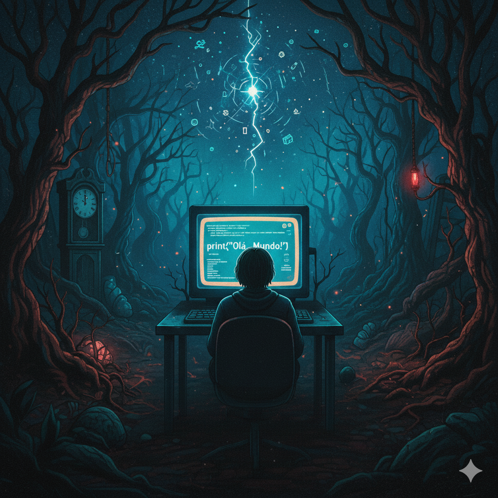

# Ebook Dark Mode: O Começo do Código
Ebook criado com utilizando as ferramentas de Inteligência Artificial e suas facilidades

# Dark Mode : O Começo do Código 
- Aprenda a usar a IA para começar sua jornada no mundo da programação.

## Projeto com o objetivo de gerar um podcast utilizando ferramentas de IA através de prompts mais trabalhado.
- Abaixo está listado as Inteligências Artificiais utilizadas para gerar o podcast 

## 💻 Tecnologias utilizadas no projeto
- [ChatGPT](https://chat.openai.com/)
- [Gemini](https://gemini.google.com/)
- [Canva](https://www.canva.com/pt_br/)
  
## ✨ Como foi feito ?
- Roteiro gerado via ChatGPT
- Gemini para gerar Capa 
- Canva para diagramação
  
ChatGPT：
|   Ação   | prompt                                                                                                                                                                                                                                                                         |
| :------: | ------------------------------------------------------------------------------------------------------------------------------------------------------------------------------------------------------------------------------------------------------------------------------ |
|  título  | Quero que você crie um titulo de ebook, que seja divertido, criativo, que fale sobre como utilizar a inteligencia artificial para te ajudar a criar os primeiros códigos, ele será voltado para o público nerd adolescente, que nunca cirou codígos, misturando com o stranger things e dark. Quero que me de 5 exemplos                                                        |
| conteúdo | Crie conteúdo para que eu monte este ebook, com sumários, subtítulos, conteúdo de cada subtítulo, uma introdução, e agradecimento, a linguagem deve ser fácil de compreender, lembrando que será focado no público jovem, principalmente aqueles que nunca desenvolveram códigos, quero que mostre como devem ser feitos.  |

Gemini：
|   Ação   | prompt                                                                                                                                                                                                                                                                         |
| :------: | ------------------------------------------------------------------------------------------------------------------------------------------------------------------------------------------------------------------------------------------------------------------------------ |
|  título  | Quero que você crie uma imagem com tamanho e resolução para eu colocar em um arquivo a4, que tem como o tema "Dark Mode: O Começo do Código", inspirado na série Dark e Stranger Things, quero que tenha elementos que remetam a esta série, seja criativo, o ebook será voltado para o público jovem, que nunca gerou códigos, possam apreender a gerar do zero e como funciona.|

📄 [Baixar o PDF completo](./karynnesilva/Ebook---Dark-Mode-O-Come-o-do-C-digo/Dark Mode - O Começo do Código.pdf)

⌨️ com 💜 por Karynne Silva
